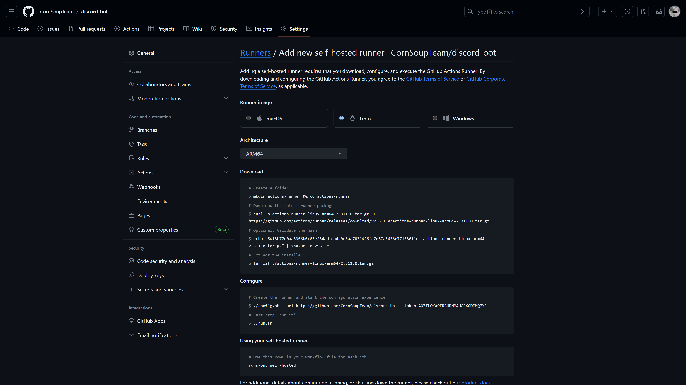

+++
title = 'Github action self-hosted를 이용한 도커 빌드 및 배포'
date = 2023-11-27T12:23:53+09:00
categories=["homelab"]
draft = true
tags = ["github","docker","self-hosted", "홈랩", "서버"]
+++

# TL;DR

Github action self-hosted를 이용해 로컬 홈랩 서버에서 Docker 이미지를 빌드 하고, 이 이미지를 동작 시킵니다. 이를 통해 CI/CD의 일련의 과정을 구축하는 경험을 가집니다.

# 깃헙 액션을 통하여 쉽고 빠르게 배포하기

안녕하세요. SVER-DEV 입니다. 이번 글에서는 기존에 SFTP를 이용하여 PM2를 이용해 무중단 배포를 진행하고 있던 서비스를, 간편한 배포와 CI/CD를 위해 Github action을 적용 해보았습니다. 이를 통해 서비스 개발 과정에서 자동 배포로 인한 개발자 피로도가 적어져서 글로 그 과정을 남겨둡니다.

> 해당 과정을 진행하기 위해선, 자체적으로 사용하실 서버를 준비 하셔야 합니다. 전 Ubuntu 20.04 ARM64 서버로 진행 했습니다.

- 우선, 배포 하실 repositories의 Settings -> Actions -> Runners 에 들어가줍니다. 메뉴 순서는 아래 이미지에서 밑줄된 곳과 같습니다.

  .png>)

- 다음으로, 위의 이미지상에서 'New self-hosted runner'를 클릭하여 아래와 같은 페이지에 진입 해줍니다.

  

- 구동할 서버의 운영체제에 맞게 Runner Image를 고르고, Architecture 또한 골라줍니다. 그럼 아래 각각 과정에 맞는 Download, Configure 의 명령어가 뜰텐데요. 그대로 붙여넣기 해주시면 됩니다! 해당 과정은 별게 없어서 넘어가도록 하겠습니다.

> 다음으로, 실제 레포에서 dockerfile 작성 및 github-action.yml 파일을 작성 해보도록 하겠습니다.

```
FROM arm64v8/node:lts-alpine3.18

ARG TOKEN
ARG CLIENTID
ARG GUILDID
ARG DATABASE_URL
ARG NEISKEY
ARG GITHUBTOKEN

ENV TOKEN=$TOKEN
ENV CLIENTID=$CLIENTID
ENV GUILDID=$GUILDID
ENV DATABASE_URL=$DATABASE_URL
ENV NEISKEY=$NEISKEY
ENV GITHUBTOKEN=$GITHUBTOKEN

ENV TZ=Asia/Seoul

WORKDIR /usr/app
COPY ./ ./
RUN npm install

CMD ["node", "main.js"]
```

- 위 dockerfile은 저희 배포 환경 상 필요한 값들을 담았습니다.
  저희 같은 경우 ARG로 여러 환경 변수를 담고, 시간대 문제로 인하여 TZ 환경변수를 Asia/Seoul로 지정 해주었습니다.

  그 후, Github 레포 상의
